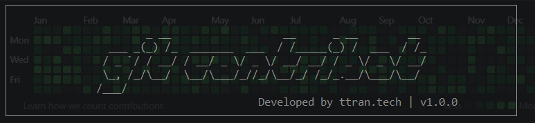
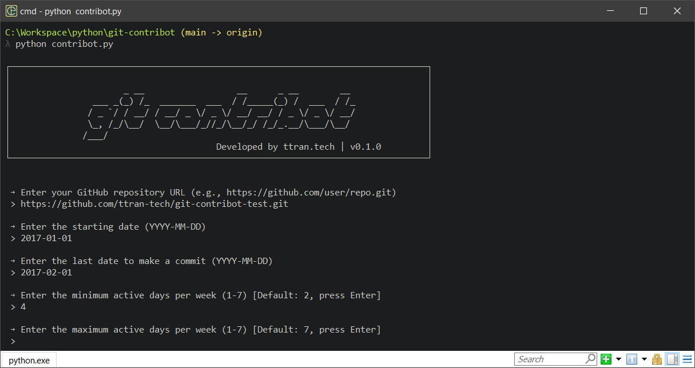
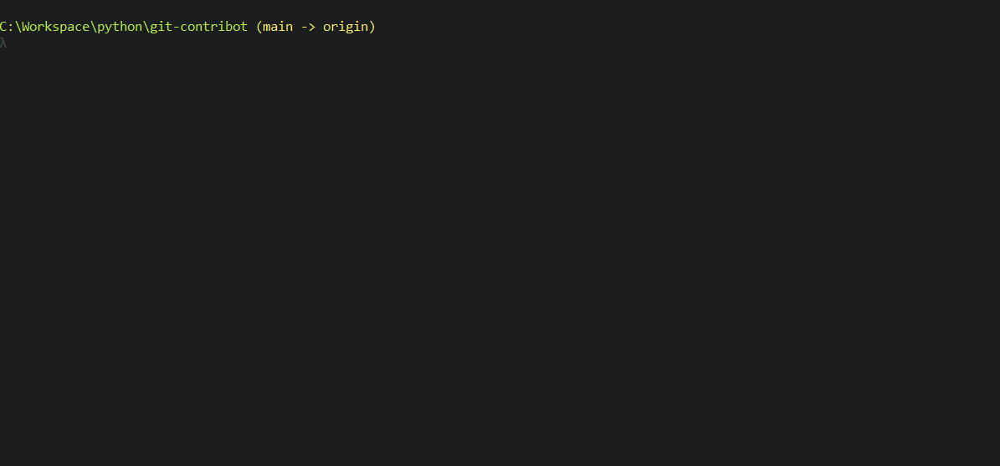
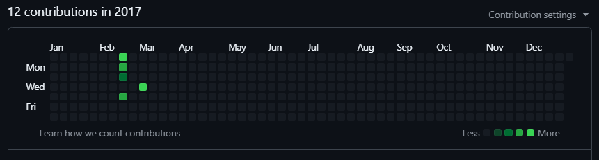
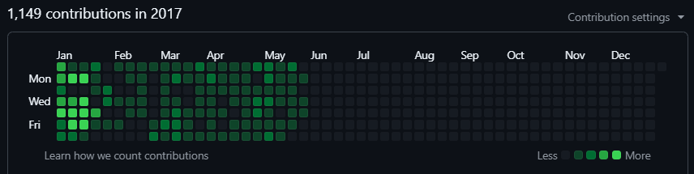
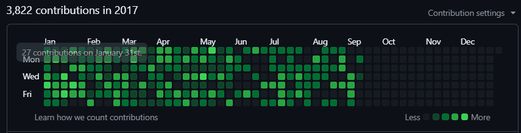
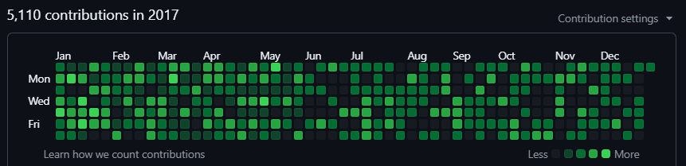

# :rocket: git-contribot: Automate Your GitHub Contribution Graph





**git-contribot** is a Python automation tool designed to fill your GitHub activity graph with past commits.
It allows you to generate commits on specific past dates, simulating a natural-looking contribution history.

🔹 Generate realistic commit histories based on user-defined parameters.

🔹 Supports concurrent execution for fast commit generation.

🔹 Automatically pushes commits to a GitHub repository.

🔹 Customizable commit frequency, active days, and commit messages.

🔹 Cross-platform support – Works on Windows & Linux (Linux requires a GitHub PAT).

## :sparkles: Features
- Customizable commit history – Define start & end dates, active days per week, and commits per day.

- Randomized commit times – Ensures a natural-looking contribution pattern.

- User-friendly prompts – Guides users through the setup process interactively.

- Concurrent execution – Uses multi-threading to speed up the commit process.

- Automatic GitHub push – Commits are pushed to the remote repository after execution.

## :gear: Installation & Usage

### :warning: Important Note for Linux Users

🔴 Due to Git’s authentication restrictions on Linux, this script requires a GitHub Personal Access Token (PAT) to authenticate git push.

🔹 Without a PAT, Git will prompt for a password every time it pushes commits, making automation impossible.

🔹 Follow the steps below to generate a PAT before running the script.

---
### 🔐 How to Generate a GitHub PAT (Personal Access Token)
1. Go to: [GitHub Personal Access Tokens](https://github.com/settings/tokens)
    - **Settings** → **Developer Settings** → **Personal Access Token** → **Token (Classic)**
2. Click **Generate New Token** → **Generate new token (classic)**
3. Enable the following scope:
    - ✅ repo (Full control of private repositories)

4. Set expiration to a short duration (e.g., 1 hour) for security.

5. Click Generate token, then copy and save it (you won’t be able to see it again).

6. Enter the PAT when prompted by the script.

*For more information on creating PAT, please refer to [GitHub Docs - Creating a personal access token (classic)](https://docs.github.com/en/authentication/keeping-your-account-and-data-secure/managing-your-personal-access-tokens#creating-a-personal-access-token-classic)*

---
### 🛠️ Usage
:one: Clone the repository

```git
git clone https://github.com/ttran-tech/git-contribot.git
cd git-contribot
```

:two: Ensure git installed

```
git --version
```

:three: Create and public an empty repository on your GitHub, copy the HTTPS URL (e.g., `https://github.com/user/repo.git`)

:four: Run the script

```Powershell
python contribot.py
```



### :pushpin: Required User Input
| Field | Description |
|---|---|
|**GitHub Repository URL**| The HTTPS URL of your GitHub repository (e.g., `https://github.com/user/repo.git`).|
|**GitHub Personal Access Token** *(Linux Only)*|If running on Linux, you will be prompted for a PAT to authenticate Git operations.|
|**Starting Date**|The first date to generate commits (format: `YYYY-MM-DD`).|
|**Ending Date**|The last date to generate commits (format: `YYYY-MM-DD`).|
|**Minimum Active Days per Week**|The minimum number of days in a week where commits should be made. (default: `2`)|
|**Maximum Active Days per Week**|The maximum number of active commit days per week (default: `7`, meaning commits every day).|
|**Starting Hour**|The earliest hour of the day when commits can start (default is `8 A`M, 24-hour format).|
|**Ending Hour**|The latest hour of the day when commits can be made (default is `17 PM`).|
|**Minimum Commits per Day**|The minimum number of commits that will be made on an active day (default: `5`).|
|**Maximum Commits per Day**|The maximum number of commits that can be made on an active day (default: `20`).|

### ⚡ Example Input

```Powershell
GitHub Repository URL: https://github.com/user/my-repo.git
GitHub Personal Access Token (Linux Only): ghp_xxxxxxxx (Linux Only)
Starting Date: 2023-01-01
Ending Date: 2023-02-01
Minimum Active Days per Week: 3
Maximum Active Days per Week: 6
Start Hour: 8
End Hour: 17
Minimum Commits per Day: 5
Maximum Commits per Day: 15
```

:memo: Note: *Once the script finished, feel free to set the repository to ***Private*** and delete the local repo.*

## :pushpin: Screenshot Demo


- Before running `git-contribot`



- `git-contribot` in process






- After running `git-contribot`




## 🚀 Contributing
Pull requests are welcome! Feel free to suggest improvements or report issues.

## 🛡️ Disclaimer
⚠️ Use this tool responsibly!

- This tool is designed for **personal use, automation testing, and experimenting with Git workflows**.  

- It is **not intended** for falsifying contribution history for professional or deceptive purposes.  

- Use this tool responsibly, and ensure compliance with GitHub’s policies.  

- The author is **not responsible** for any misuse of this tool.

## 📜 License
This project is licensed under the [MIT License](LICENSE).

## 📌 Future Improvements
✅ Simulate pull requests & branch merges

✅ Automatic cleanup of temporary commits

✅ SSH authentication for easier GitHub integration

## 👨‍💻 Author

:diamond_shape_with_a_dot_inside: GitHub: [ttran-tech](https://github.com/ttran-tech)

:e-mail: Email: [duy@ttran.tech](duy@ttran.tech)

## 🔥 Final Notes
If you find this project useful, consider giving it a ⭐ on GitHub! 🚀
